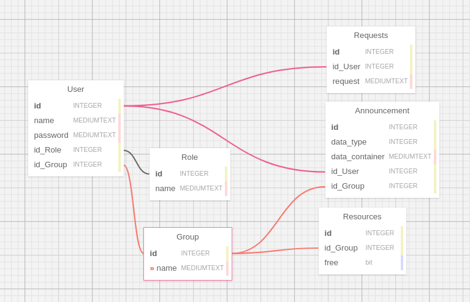

DRT
---

Web-приложение, предназначенное специально для автоматизации внутри офисного взаимодействия.

В наше непростое время, полезно оптимизировать личные встречи работников офиса между собой. DRT позволит автоматизировать рутинные действия, такие, как бронь переговорки или стола в опенспейсе, заказ различных продуктов и вещей первой необходимости для офиса.

# Компоненты:

* Клиент: ```Реализована с использованием стека технологий JavaScript+HTML+CSS```
    * Карта офиса
    * Форма отправки заявки
    * Форма создания объявлений (привелигированные пользователи)
    * Интерфейс просмотра объявлений
    * Интерфейс администрирования

* Сервер: ```Технологии: Python3, Flask, SQLAlchemy, PostgreSQL```
    * Обработка запросов клиента
    * Взаимодействие с базой данных
    * Проверка прав доступа
    * Отправка данных клиенту
    * Менеджмент заявок и ресурсов


# Точки расширения
1. Различные права доступа:

	* Админ. (✔)
	* Фуллтайм разработчик (✔)
	* Стажер.
	* Хозяюшка.

2. Доска объявлений(или чат)

	* Отправка сообщений (✔)
	* Отправка картинок с различным расширением (✔)
	* Опросы

3.  Запросы

	* Бронирование столов в офисе (✔)
	* Заказ продуктов у хозяюшки
	* Бронирование переговорки (✔)


# Слои:

1. UI: Взаимодействие с пользователем производится либо через браузер, либо через Telegram бота. Получая информацию, форматирует ее соответствующим образом (классы), и передает в Application. И в обратную сторону: получает информацию и обновляет клиентский интерфейс с учётом новых данных.

2. Application: Интерфейсы для работы с Web версией приложения или Telegram бота.

3. Domain: Имеются несколько абстрактных классов, каждый из которых отвечает за определенную функцию. Реализаций может быть несколько, например абстрактный класс User, определяет пользователя, а его реализации будут разными, в зависимости от его прав доступа, например AdminUser, FullTimeDeveleper e t.c.

4. Infrastructure: Взаиможействие с базой данных



# Паттерны back-end:
* Для обработки запросов клиентов и сообщений на доску объявлений будем использовать паттерн Visitor
* Fabriс - для генерации сообщений доступа
* Декоратор... Куда без него в питоне с Flask
* Делегирование

* DI-container с использованием https://github.com/warnersean/python_di

# Паттерны front-end:
* Строитель
* Абстрактная фабрика
* Посредник
* Наблюдатель
* DI-container с использованием https://github.com/jeffijoe/awilix
----

Состав команды разработки:

- Анчутин Никита
- Ложкин Александр
- Фролов Юрий
- Юрченко Степан

